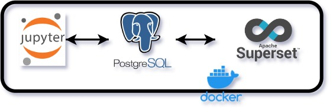

# data_analyst_framework
Create a work environment that combines useful services to easily manipulate and visualize data.

  

------
To do:
  - Integrate **Minio** to Persist models in binary files and every other data that doesn't have a traditional tabular structure.
  - Develop an api with **FastAPI** to deploy the model.
